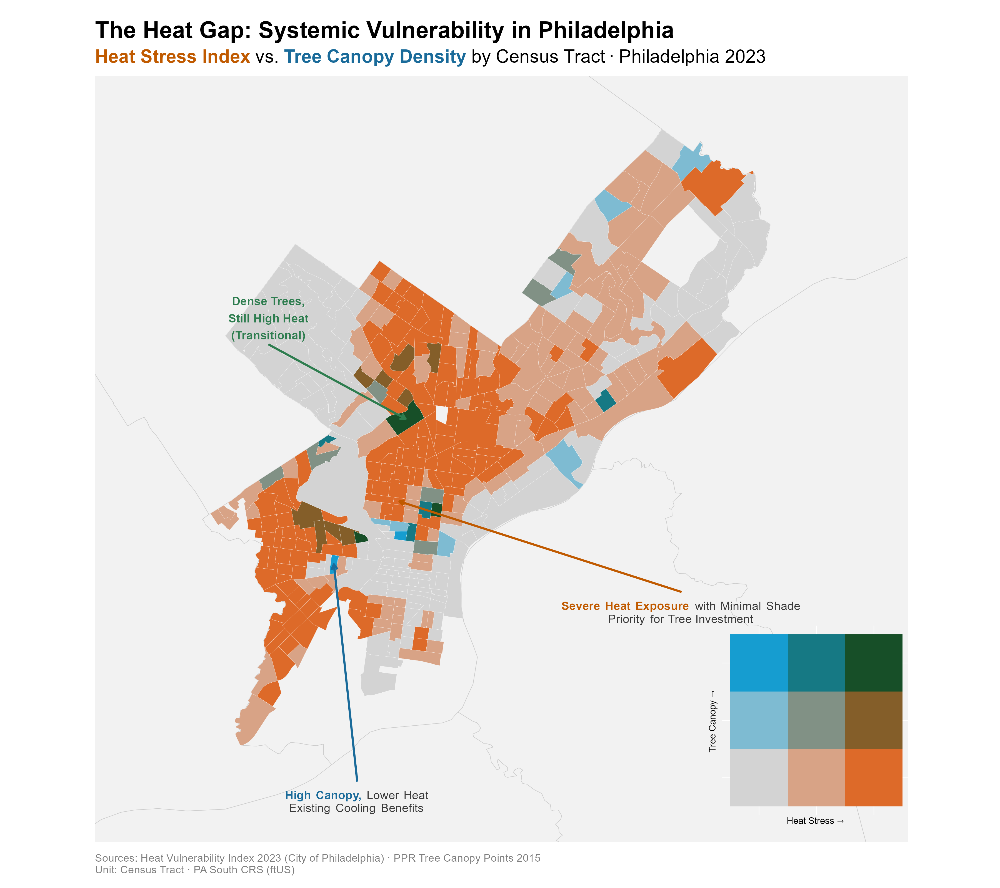
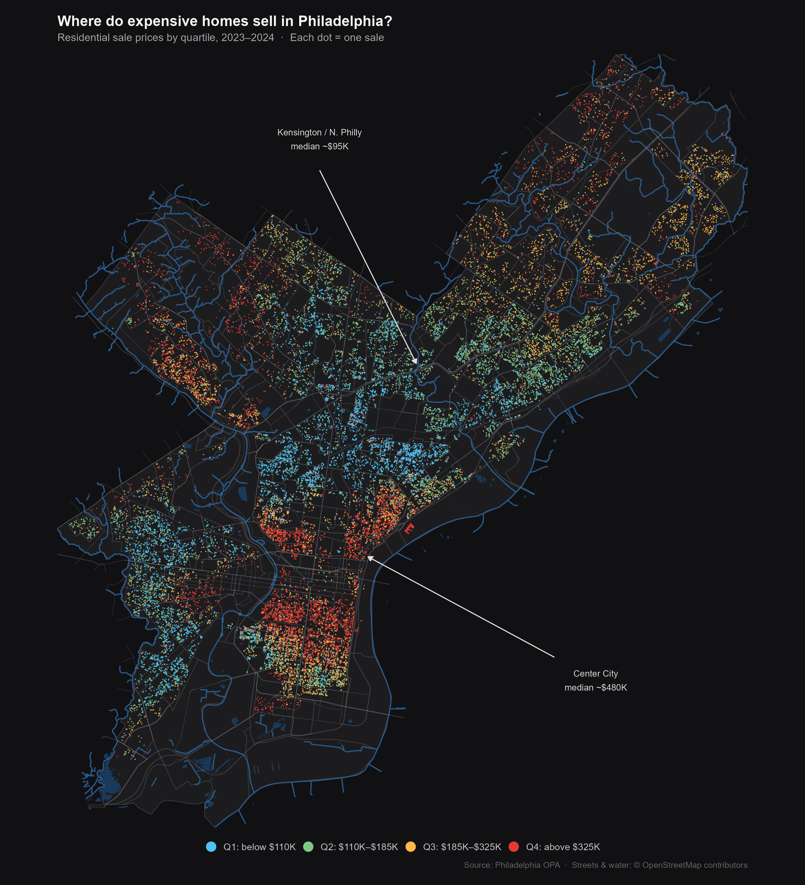
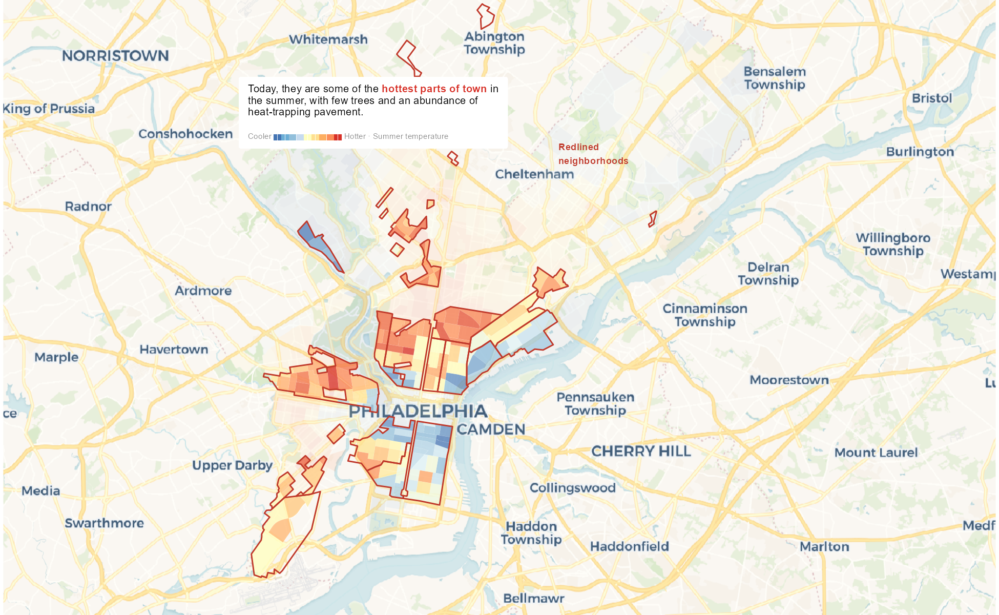
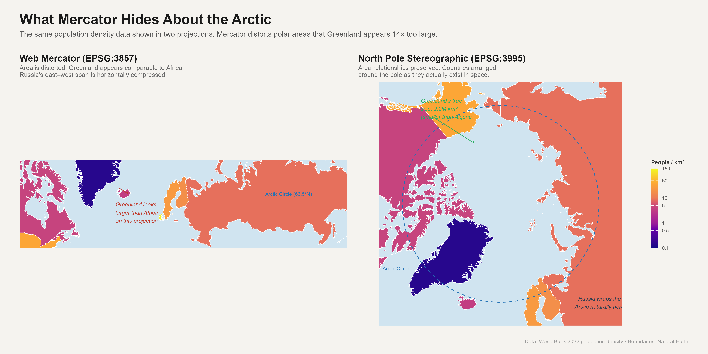
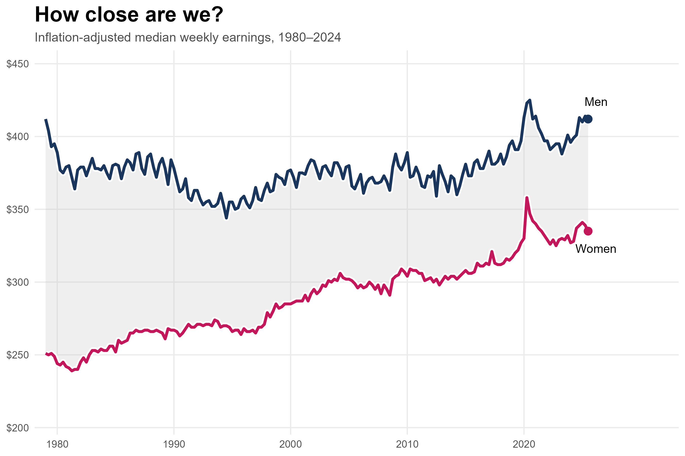
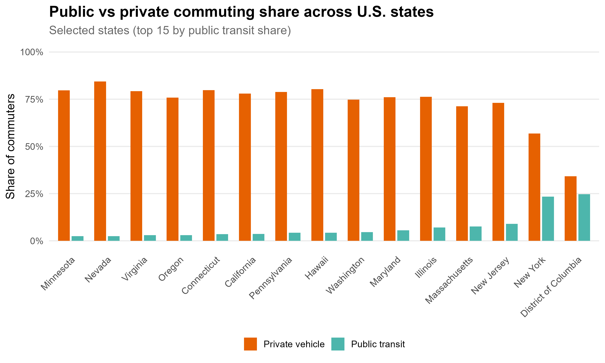

---
format:
  html:
    toc: false
---

```{=html}
<div class="category-page-header">
  <h1 class="category-page-title">Visualization</h1>
  <p class="category-page-desc">Charts, maps, and visual explorations from urban and spatial datasets.</p>
</div>

<div class="viz-grid">

  <div class="viz-card">
    
    <div class="viz-card-body">
      <p class="viz-card-title">Philadelphia Heat &amp; Canopy Cover</p>
      <p class="viz-card-desc">Bivariate choropleth showing the spatial relationship between urban heat exposure and tree canopy coverage across Philadelphia neighbourhoods.</p>
    </div>
  </div>

  <div class="viz-card">
    
    <div class="viz-card-body">
      <p class="viz-card-title">Philadelphia Housing Price Model</p>
      <p class="viz-card-desc">Choropleth of predicted residential sale prices from a spatial OLS regression model, highlighting value gradients across the city.</p>
    </div>
  </div>

  <div class="viz-card">
    
    <div class="viz-card-body">
      <p class="viz-card-title">Spatial Analysis Output</p>
      <p class="viz-card-desc">Thematic map produced from a GIS-based spatial analysis workflow, visualising geographic patterns in urban data.</p>
    </div>
  </div>

  <div class="viz-card">
    
    <div class="viz-card-body">
      <p class="viz-card-title">Arctic Polar Projection</p>
      <p class="viz-card-desc">Polar-centred map projection visualising Arctic spatial data, demonstrating custom CRS and cartographic design in Python.</p>
    </div>
  </div>

  <div class="viz-card">
    
    <div class="viz-card-body">
      <p class="viz-card-title">Fertility vs. Female Life Expectancy</p>
      <p class="viz-card-desc">Scatter plot exploring the cross-national relationship between total fertility rate and female life expectancy, faceted by world region.</p>
    </div>
  </div>

  <div class="viz-card">
    
    <div class="viz-card-body">
      <p class="viz-card-title">Wage Gap by Demographic Group</p>
      <p class="viz-card-desc">Bar chart comparing median wage gaps across gender and racial demographic groups, highlighting persistent earnings disparities.</p>
    </div>
  </div>

  <div class="viz-card">
    
    <div class="viz-card-body">
      <p class="viz-card-title">Public vs. Private Sector Outcomes</p>
      <p class="viz-card-desc">Grouped bar chart comparing key economic outcomes between public and private sector employment across different cohorts.</p>
    </div>
  </div>

</div>
```
